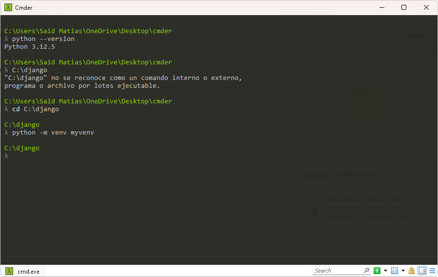
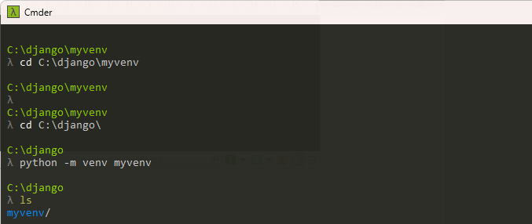
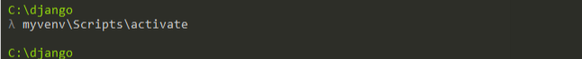
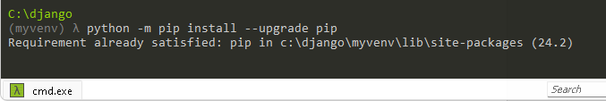
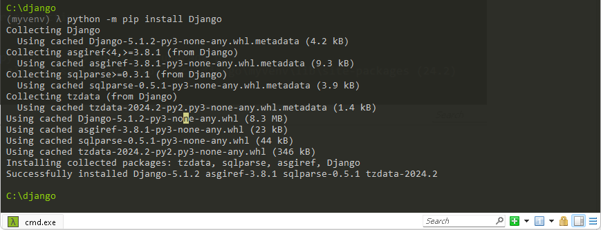
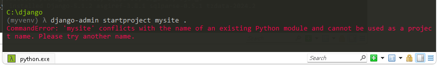
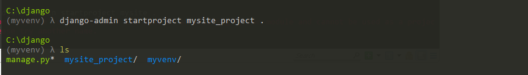
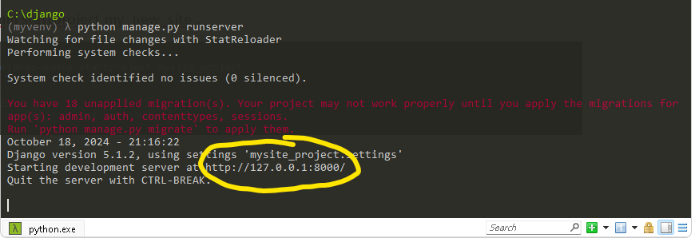

# Manual de instalación y configuración 
-	Verificamos la Versión de Python.  Python --version
-	Creamos una carpeta en el disco local con el comando (mkdir –(Nombre de la Carpeta)

-	Escribimos el comando cd y entramos a la ruta donde esta nuestra carpeta.
-	Escribimos el comando `Python -m venv myvenv` se utiliza para crear un **entorno virtual** en Python. Este entorno virtual tiene varias ventajas: 1. **Aislamiento de dependencias**: Permite instalar paquetes y bibliotecas sin afectar el sistema global de Python ni otros proyectos. Cada entorno virtual tiene su propio espacio para paquetes.
-	Ls: Visualizar archivos y directorios: Muestra una lista de todos los archivos y subdirectorios en el directorio actual.

-	El comando myvenv\Scripts\activate sirve para activar el entorno virtual que creaste con el comando venv. Activar el entorno virtual significa que, a partir de ese momento, cualquier comando que ejecutes (como instalar paquetes con pip o ejecutar scripts) se ejecutará dentro de ese entorno aislado, en lugar de en el sistema global de Python.

-	El comando python -m pip install --upgrade pip se utiliza para actualizar pip, que es el gestor de paquetes para Python. 
-	Instalación de paquetes: pip permite instalar, actualizar y desinstalar paquetes de Python desde el índice de paquetes de Python (PyPI).
-	Mejoras y correcciones: Al actualizar pip, obtienes las últimas mejoras, correcciones de errores y nuevas características que pueden facilitar la gestión de paquetes.
-	Compatibilidad: Mantener pip actualizado asegura que sea compatible con las últimas versiones de Python y los paquetes disponibles.

-	El comando python -m pip install Django se utiliza para instalar Django, que es un popular framework de desarrollo web para Python. Aquí te explico qué hace:
-	Instalación del framework: Al ejecutar este comando, pip descarga e instala la última versión de Django desde el índice de paquetes de Python (PyPI).
-	Facilidad de uso: Django proporciona herramientas y funcionalidades para construir aplicaciones web de manera más rápida y eficiente, incluyendo manejo de bases de datos, autenticación, y un sistema de administración.
-	Ecosistema: Instalar Django también te permite acceder a una amplia variedad de bibliotecas y extensiones que se integran con el framework.

-	El comando django-admin startproject mysite . se utiliza para iniciar un nuevo proyecto de Django dentro del directorio actual (.).
-	se debe a que el nombre "mysite" ya está en uso como nombre de un módulo en Python, lo cual genera un conflicto. Para resolverlo, asi que cambien el nombre 

- Cambien el nombre a este
django-admin startproject my_new_site .

• El comando python manage.py runserver se utiliza para iniciar el servidor de desarrollo de Django, lo que te permite probar y ver tu aplicación web en tu navegador localmente mientras la desarrollas.
Presionamos CTRL Y damos clic al link que nos muestra

